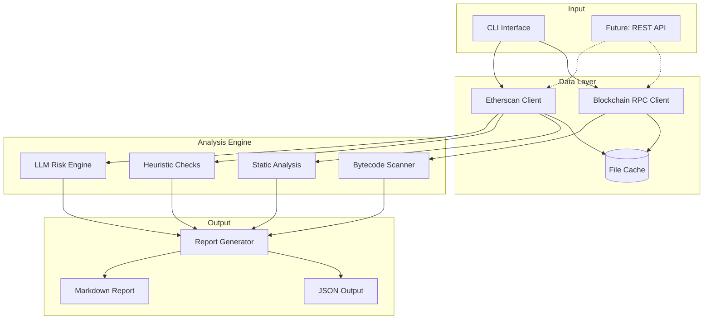

# Architecture Overview

This document describes the high-level architecture of DeFi Risk Analyzer.

## System Diagram

## Component Responsibilities

### Data Layer

| Component | Responsibility |
|-----------|----------------|
| **BlockchainRPC** | Fetches contract bytecode via JSON-RPC (Alchemy/Infura) |
| **EtherscanClient** | Retrieves verified source code via Etherscan API v2 |
| **FileCache** | TTL-based caching to reduce API calls and improve performance |

Both clients implement automatic retry with exponential backoff for resilience.

### Analysis Engine

| Component | Responsibility |
|-----------|----------------|
| **Static Analysis** | Rule-based pattern matching against source code |
| **Heuristic Checks** | Best-effort detection of missing security modifiers |
| **Bytecode Scanner** | Opcode sequence detection when source unavailable |
| **LLM Risk Engine** | AI-powered contextual analysis via OpenAI API |

The analysis pipeline runs all components in sequence, aggregating findings into a unified report.

### Output Layer

| Component | Responsibility |
|-----------|----------------|
| **Report Generator** | Computes security score and formats findings |
| **JSON Output** | Structured data for programmatic consumption |
| **Markdown Report** | Human-readable security report |

## Data Flow

1. **Input**: User provides contract address via CLI
2. **Fetch**: Bytecode (RPC) and source code (Etherscan) are retrieved with caching
3. **Analyze**: All analysis modules process the contract data
4. **Enrich**: LLM adds contextual insights (optional, requires API key)
5. **Score**: Severity-weighted scoring computes overall risk (0-100)
6. **Output**: Report generated in requested format

## Design Principles

- **Separation of Concerns**: Each module has a single, well-defined responsibility
- **Graceful Degradation**: Analysis continues even if some data sources fail
- **Resilience**: Retry logic and caching handle transient failures
- **Extensibility**: New rules and checks can be added without modifying core logic
